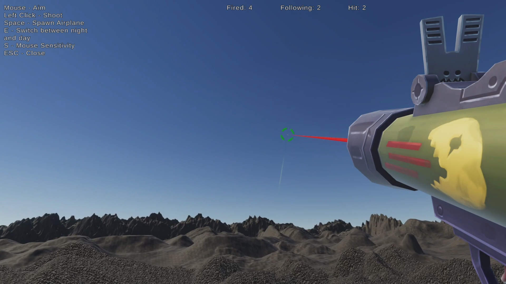
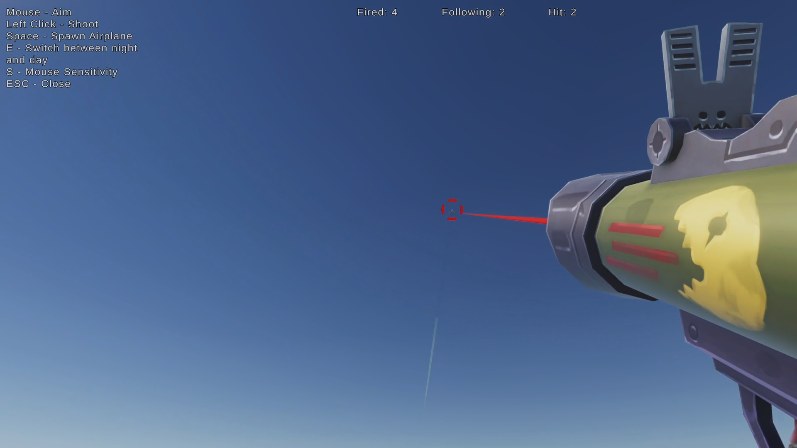
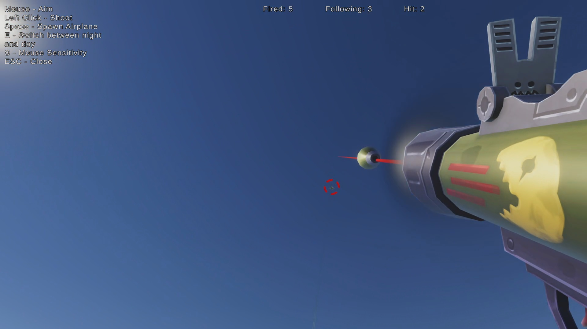
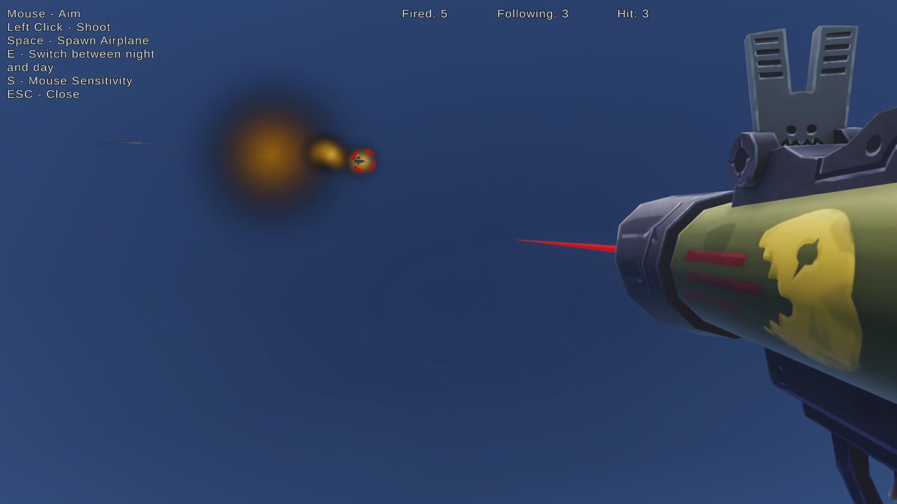
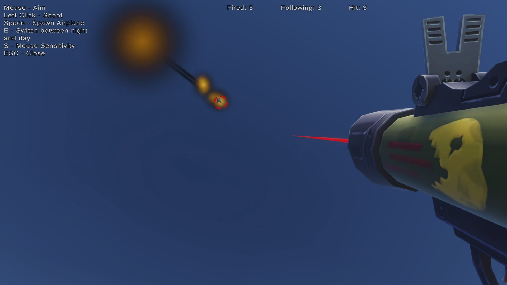
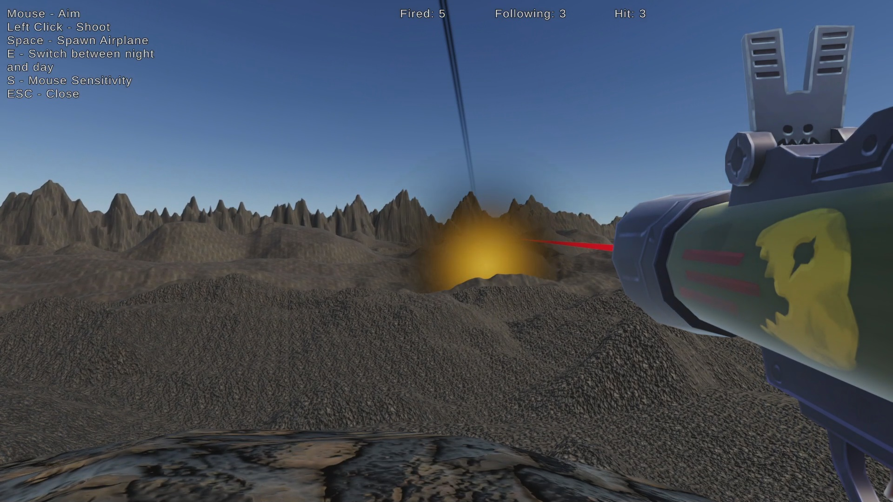
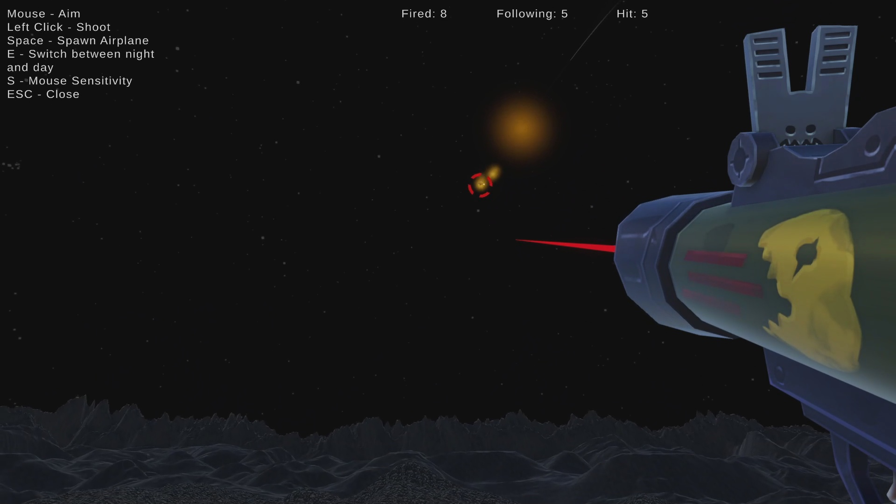

<!-- PROJECT TITLE -->

  <h1 align="left">Rocket Launcher Simulator</h1>

<!-- ABOUT THE PROJECT -->
## About The Project
This application simulates the process of shooting jet aircrafts. In order to hit the jet, the user is required to target it for a few seconds, then shoot ahead of it at the right distance. 
 
Its features include:
* 3 types of jet airplanes
* 20 jet spawn points scattered across the edges of the map
* guided missiles
* support for both night time and day time

## Download

Get the .zip [here](https://github.com/teo3fl/Rocket-Launcher-Simulator/releases)

## Usage

### Controls
* Mouse - aim
* LMB - shoot
* E - switch between night and day
* S - change the mouse sensitivity
* Escape - close

### Shooting jets during daytime 

<b>Step 1:</b> find the jet and aim at it for a few seconds (when the green target appears, it's aiming). 
 
 
 
After a few seconds of perfect aim, the target is locked (it turns from green to red). 
 
 
 
<b>Step 2:</b> shoot ahead of the jet. 
 
 
 
If the missile was shot properly, it will follow the jet and hit it. 
 
 
 
<b>Step 3:</b> watch the plane fly into the ground 
 
 
 
... and burn. 
 
 

### Shooting jets during nighttime

Same as shooting them during daytime, but it's dark. 
 

